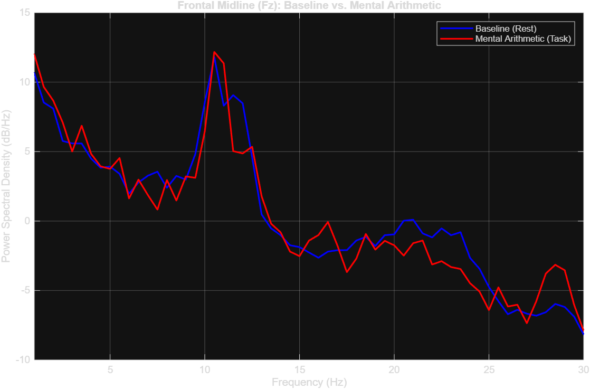
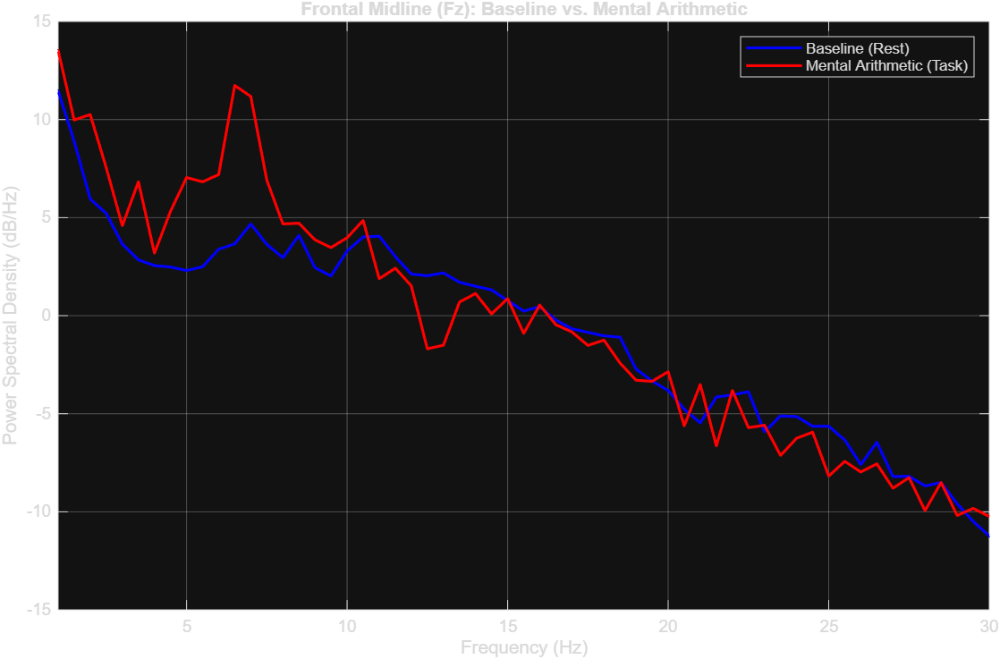
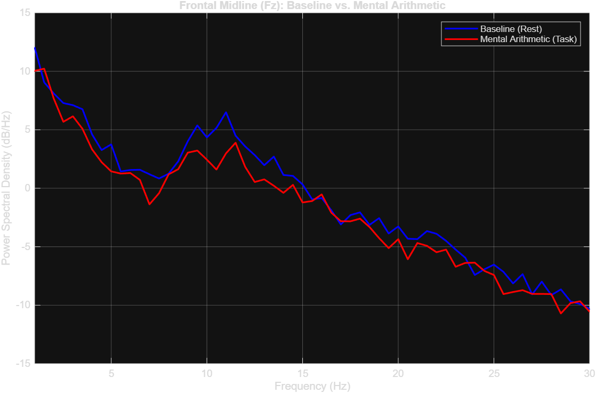
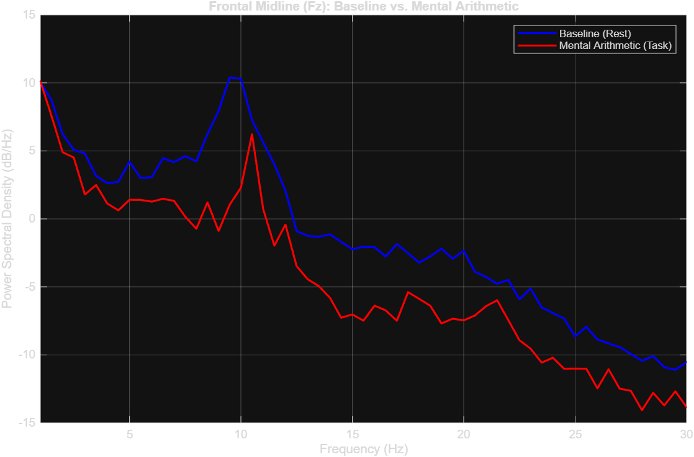

# EEG Cognitive Workload Biomarker Pipeline

An automated, standalone MATLAB signal processing pipeline designed to quantify neurophysiological shifts under mental arithmetic stress using PhysioNet EEG recordings. The pipeline extracts frequency-domain features without black-box toolbox dependencies, performs dynamic artifact rejection, and computes validated cognitive load biomarkers.

---

## 🔬 Neurophysiological Biomarkers

* **Frontal Midline Theta-to-Beta Ratio (TBR):** Quantifies working memory load and mental effort at lead $F_z$:
  $$\text{TBR} = \frac{\int_{4}^{8} P(f)\,df}{\int_{13}^{30} P(f)\,df}$$
* **Frontal Alpha Asymmetry (FAA):** Evaluates lateralized approach/avoidance motivation and task engagement between leads $F_4$ (right) and $F_3$ (left):
  $$\text{FAA} = \ln(P_\alpha(F_4)) - \ln(P_\alpha(F_3))$$

---

## 🛠️ Pipeline Architecture

1. **Headless Ingestion:** Automated loading of raw EDF continuous recordings via BioSig.
2. **Channel Mapping:** 2D/3D spherical electrode coordinate alignment using standard 10–20 montage templates (`standard-10-5-cap385.sfp`).
3. **Filtering:** Linear-phase bandpass filtering ($0.5\text{--}45\text{ Hz}$) to isolate physiological rhythms while eliminating DC offset and high-frequency EMG.
4. **Segmentation & Baseline Normalization:** Regular $2\text{-second}$ windowing ($1000\text{ samples}$ at $500\text{ Hz}$) followed by whole-epoch mean subtraction.
5. **Dynamic Artifact Thresholding:** Amplitude-based trial rejection ($\pm 80\,\mu\text{V}$) across all 19 scalp channels to purge ocular and myogenic bursts.
6. **Spectral Decomposition:** Direct discrete Fourier transform (FFT) power spectral density estimation and numerical quadrature integration (`trapz`).

---

## 📊 Results & Validation ($N=4$)

| Subject | Baseline Midline TBR | Task Midline TBR | Delta(TBR) | Baseline FAA | Task FAA | Delta(FAA) | Observed Neurodynamics |
| :--- | :--- | :--- | :--- | :--- | :--- | :--- | :--- |
| **Subject 00** | 0.7663 | 0.8042 | +0.0379 | 0.0416 | 0.0888 | +0.0472 | Event-Related Desynchronization (ERD) at 10 Hz |
| **Subject 01** | 0.7876 | 3.0828 | +2.2952 | 0.0011 | -0.1136 | -0.1147 | High-amplitude Frontal Midline Theta surge |
| **Subject 02** | 0.7292 | 0.6843 | -0.0450 | -0.1326 | -0.1604 | -0.0278 | Broadband engagement, sustained Alpha drop |
| **Subject 03** | 1.2877 | 1.7566 | +0.4689 | 0.0461 | 0.0026 | -0.0436 | Global suppression across lower spectra |

### Spectral Power Shift (Baseline vs. Arithmetic Task)









---

### How to Run

1. Clone this repository:
```bash
git clone [https://github.com/Prernasalya/eeg-cognitive-workload-pipeline.git](https://github.com/Prernasalya/eeg-cognitive-workload-pipeline.git)
```

## 📚 Dataset Reference

Data sourced from PhysioNet:
* **Dataset:** [EEG During Mental Arithmetic Tasks](https://physionet.org/content/eegmat/1.0.0/)
* **Format:** Continuous recordings (.edf), 19 scalp channels (10–20 international system), 500 Hz sampling rate.
* **Conditions:** 3-minute resting baseline (eyes open/closed) vs. 1-minute intensive serial subtraction task.
